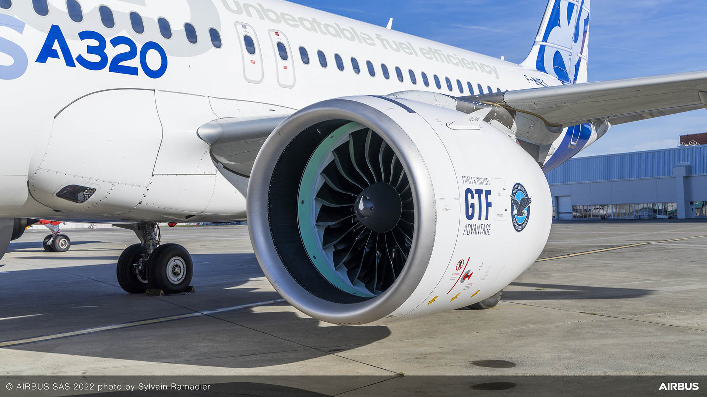

## Portfolio

---

### Projects

[Turbofan Engine Design, and Optimisation for an Airbus A320neo](/Turbofan.md)

---
[Airplane Autopilot Landing System Development, and Refinement](/pdf/sample_presentation.pdf)

---
[Winglet Design, Simulation, and Optimisation for a Boeing 737-800](http://example.com/)

---
[RC STOL Plane Group Design Project](http://example.com/)

---
[Response of a T-Beam Under Load using Three Methods](http://example.com/)

---

---

Page template forked from <a href="https://github.com/evanca/quick-portfolio">evanca</a>

<!-- Remove above link if you don't want to attibute -->
