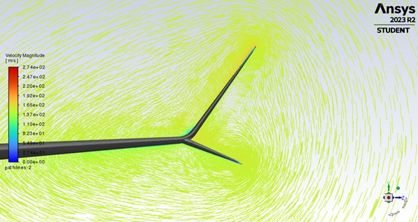
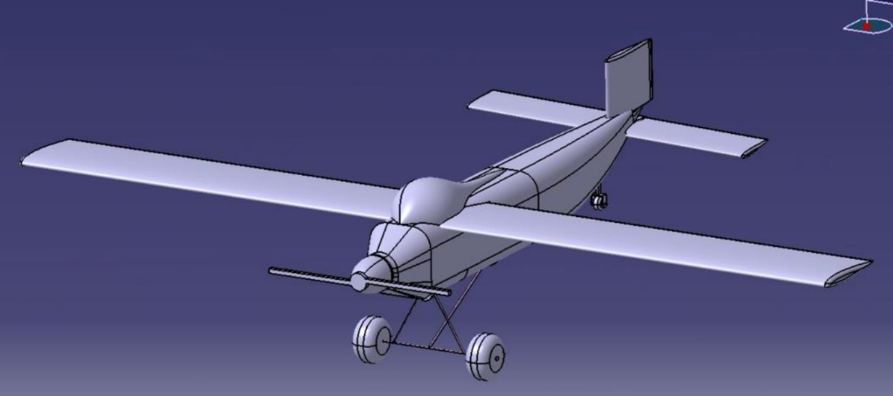
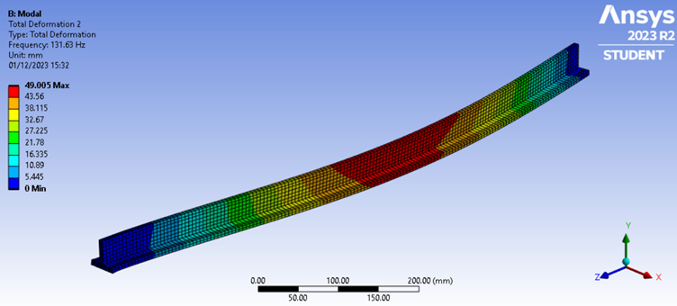

## Portfolio

---

### Projects

[Turbofan Engine Design, and Optimisation for an Airbus A320neo](/Turbofan.md)

---
[Autopilot Landing System Development, and Controller Implementation](/Autopilot.md)

---
[Winglet Design, Simulation, and Optimisation for a Boeing 737-800](/Winglet.md)

---
[RC STOL Plane Group Design Project](http://example.com/)

---
[Response of a T-Beam Under Load, Using Three Methods](/TBeam.md)

---

Page template forked from <a href="https://github.com/evanca/quick-portfolio">evanca</a> by <a href="https://github.com/orderedlist">orderedlist</a> 

